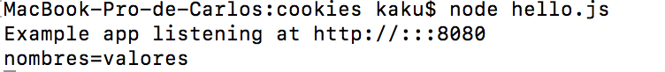

# Cookies

Para su uso primero es necesario instalar su modulo.

~~~
npm install cookie
~~~
 y para su uso:

~~~
var cookie = require('cookie');
~~~

## Cookie.parse.

Con el método parse, podemos pasarle una lista de cookies y nos devolverá un objeto que contenga cada par nombre-valor:

~~~
var cookies = cookie.parse('nombre=valor; name=value');
~~~

Que podremos mostrar por ejemplo por consola:

~~~
app.get('/cookiess',function(req, res){
        console.log(cookiess)
});
~~~

Además, se le pueden añadir la opción ***'decodeURIComponent'*** para decodificar el cookie.

## Cookie.serialize.

Permite crear una cadena de ayuda que contiene el par nombre-valor.

~~~
var setCookie = cookie.serialize('nombres', 'valores');
~~~

Podemos mostrarlo igual que los creados con Cookie.parse

Este método acepta opciones como tercer atributo:

* domain. Indica el valor del dominio donde se aplica.
* encode. Codificar el valor del cookie.
* expire. Indica hasta cuando funciona el cookie.
* httpOnly. Para activar dicha opción en el cookie.
* maxAge. Indicando el numero de segundos. Se producirá la cuenta atrás.
* path. Para indicar el path por defecto.
* secure. Si el navegador no tiene conexión https no reenvia el cookie. 
